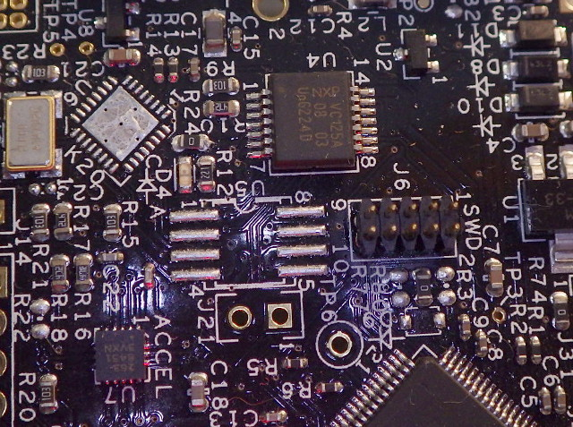

William Wallace
===============

A very simple red blinken' light on the [FRDM-KL25Z][0] dev kit from Freescale.

Build with [gcc-arm-embedded][1] and load with [J-Link][2], an [Olimex
adapter][3], [J-Link's GDB server][4] and GDB.

To do this, you'll need to modify the FRDM board to remove the OpenSDA circuit
and add the SWD header.  Removing U6, the OpenSDA micro, is best done with a
hot-air rework station.  Adding J6, the SWD header, can use any through hole 5x2
0.05" header.

[0]: http://www.element14.com/community/docs/DOC-54879
[1]: https://launchpad.net/gcc-arm-embedded
[2]: http://www.segger.com/debug-probes.html
[3]: https://www.olimex.com/Products/ARM/JTAG/ARM-JTAG-20-10/
[4]: http://www.segger.com/jlink-gdb-server.html
